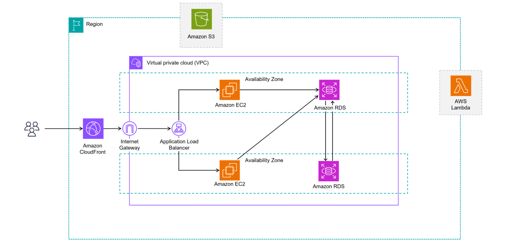
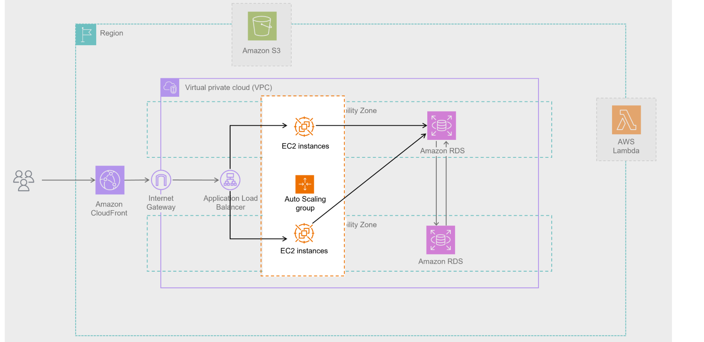
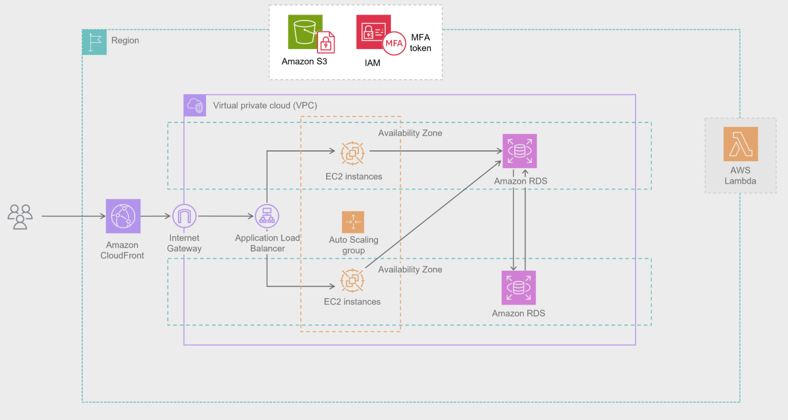
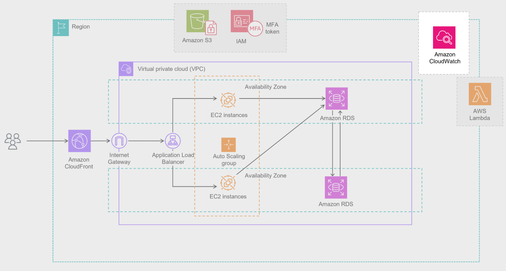
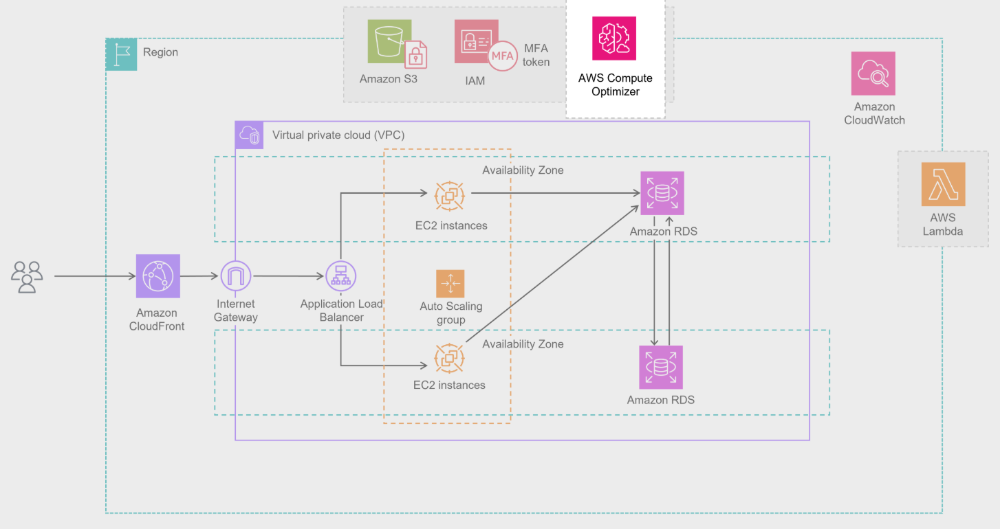
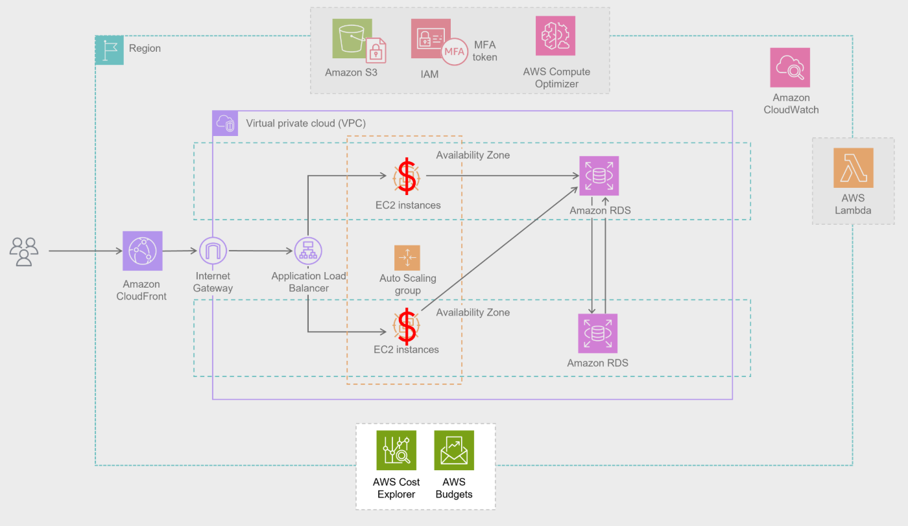
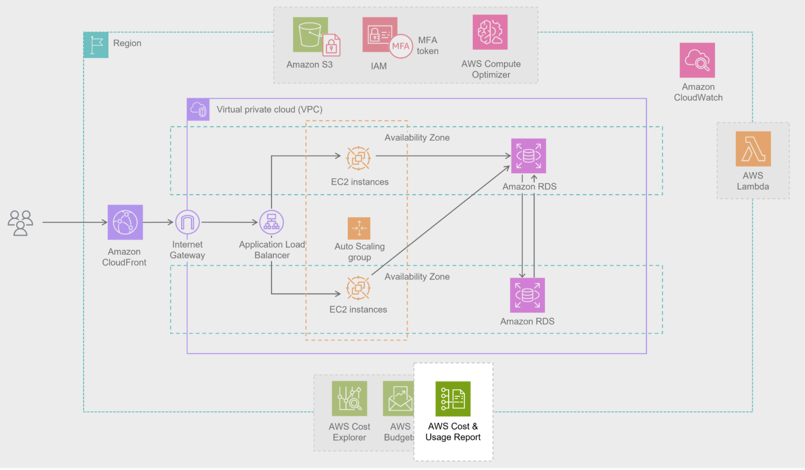

### Well-Architected Framework pillars

Operational Excellence:
Focuses on operations, monitoring, automation, and continuous improvement

Security:
Protects systems and data through best practices like least privilege and data integrity

Reliability:
Emphasizes recovery planning and system adaptability to meet changing demands

Performance Efficiency:
Encourages using the right resources for the job and adjusting as needs evolve

Cost Optimization:
Helps control and reduce costs through smart provisioning and resource management

Sustainability:
Promotes energy-efficient design and environmentally conscious resource usage

### Use Case

- Step 1

Let’s look at your current setup. You have a classic ecommerce architecture. It includes Amazon Elastic Compute Cloud (Amazon EC2) instances for the website and Amazon Relational Database Service (Amazon RDS) databases to handle orders and customer data. It also has an Amazon Simple Storage Service (Amazon S3) bucket full of product images. It’s functional, but let's evaluate how well it's scaling and handling traffic—especially during busy times.

- Step 2 Enhancement 

Your business is running smoothly, but what happens if an EC2 instance crashes during a rush of orders? To be truly resilient, you can automate scaling with EC2 Auto Scaling. Additionally, to make day to day operations more reliable and efficient, you can use infrastructure as code and implement self healing mechanisms like auto-rollback. These practices help your system adapt during high-demand periods as well as operate efficiently over time.

- Step 3 Enhancement 

You’ve already got a secure foundation with an Amazon Virtual Private Cloud (Amazon VPC), but there’s more to do. Ask yourself: Are your EC2 instances regularly patched? Do your IAM policies follow the principle of least privilege? Protecting customer data—like names, addresses, and payment info—requires strong encryption for data at rest and in transit, along with fine-grained access controls. Strengthening these layers builds trust with your customers and safeguards sensitive information.

- Step 4 Enhancement 

During busy seasons, availability is everything. You’ve already taken a great step by deploying resources across multiple Availability Zones, but you can increase reliability even further. Use Amazon CloudWatch to monitor your system’s health and set up automated recovery actions.

- Step 5 Enhancement

As your business scales, your system should scale with it. Are your EC2 instances and RDS instances rightsized for your workload? AWS Compute Optimizer can help make sure you’re not wasting resources or underprovisioning your infrastructure. You’re already using AWS Lambda for event-driven tasks like image processing, which is great for flexible scaling. Make sure those functions are rightsized, too. And with Amazon CloudFront, you can already deliver product images quickly to global customers for a smooth, fast shopping experience.

-Step 6

You're currently using On-Demand EC2 instances, which are great to start with, but switching to Spot Instances for variable traffic and Savings Plans for steady workloads can cut costs significantly. Track and manage your cloud spending in real time with AWS Budgets and AWS Cost Explorer. These tools help you make smart, cost-effective decisions while maintaining performance and reliability.

-Step 7

Your use of serverless and elastic resources already reduces your environmental footprint. To go further, continue optimizing workloads to minimize resource waste. Doing so benefits both the planet and your bottom line—proving that environmentally conscious decisions can also be business-smart.

