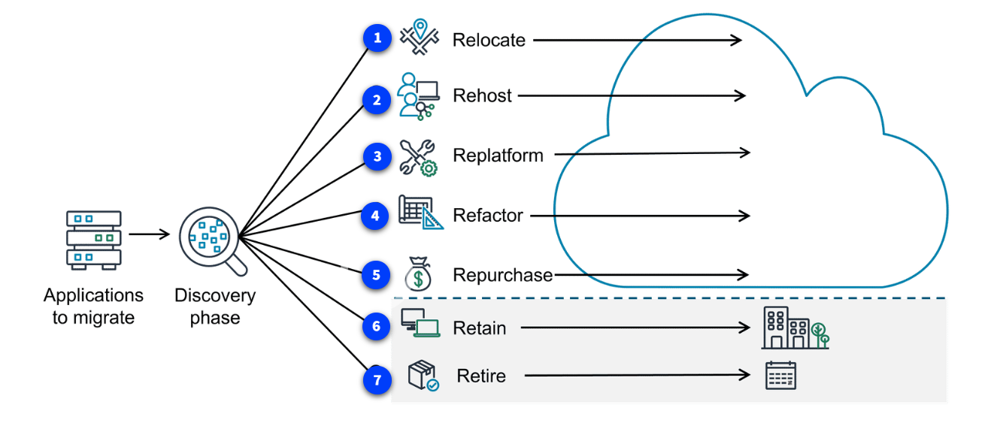

#### AWS CAF

The AWS CAF is a framework that brings AWS experience and best practices to companies preparing to migrate to the AWS Cloud. The framework provides tools to help accelerate the migration journey, organize resources, and align management during the transition.

Benefits: AWS CAF provides benefits for migrations to reduce business risk and improve sustainability and corporate transparency. Companies can grow revenue by creating new products and services in their cloud transformation. They can also reduce operational costs, increase productivity, and improve customer experience in their new cloud environment.

Use cases: You can use AWS CAF to migrate technology like legacy infrastructure and applications. You can also use it to migrate and optimize business processes, operations, and even create new business models with the move to the cloud.

#### Seven migration strategies

The most common paths to the cloud

When customers are migrating applications to the cloud, they can use seven common migration strategies. The decision on which strategy depends on factors such as the complexity of existing applications, business goals, time constraints, and available resources. Often, organizations will use a combination of these strategies across their application portfolio. By carefully considering each option and aligning it with specific applications and objectives, organizations can create a tailored migration plan that maximizes the benefits of cloud adoption while minimizing risks and disruptions.

To learn more about the migration strategies, choose each of the seven markers.\

#### AWS DMS

The AWS Database Migration Service (AWS DMS) makes it possible to quickly and securely migrate databases and perform ongoing data replication tasks for live databases and data warehouses. It provides a way to plan, assess, convert, and migrate databases even with data warehouses in one central tool.

Benefits: AWS DMS provides benefits for migrating databases including maintaining high availability and low downtime during the migration process. It supports homogenous and heterogenous migrations. It also makes it possible to migrate terabyte sized databases at a low cost.

Use cases: You can use AWS DMS to move to managed databases, remove licensing costs, replicate ongoing changes in your database, and improve integration with data lakes.

#### AWS SCT

AWS SCT makes it possible to convert database schemas and code objects (like stored procedures, views, and functions) from one database engine to another. AWS SCT can even give you estimates of how big of an effort a conversion is, which helps with planning.

Benefits: AWS SCT provides benefits to simplify database migrations by automating schema analysis, recommendations, and conversion at scale. It is compatible with popular databases and analytics services as source and target engines. It can save weeks or months of manual time and resources, which are typically required in conversions.

Use cases: You can use AWS SCT to move from commercial databases to open source databases. You can also use it for migrating large data warehouse workloads and modernizing or updating database schemas in place.