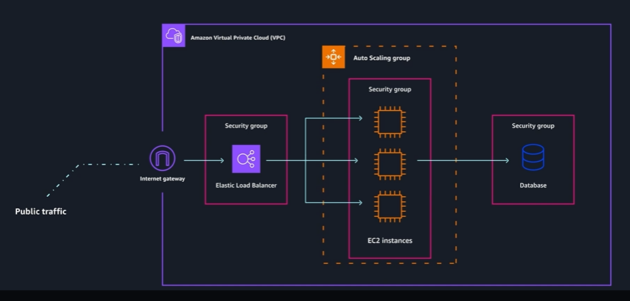
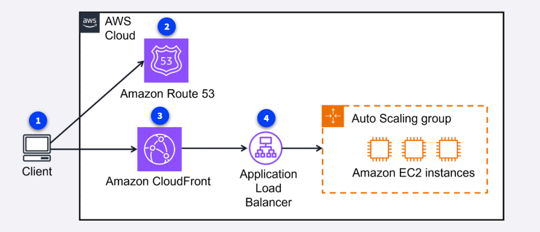
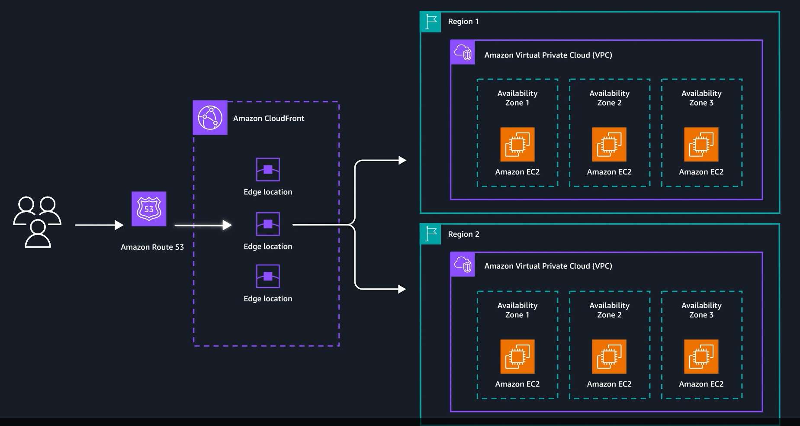
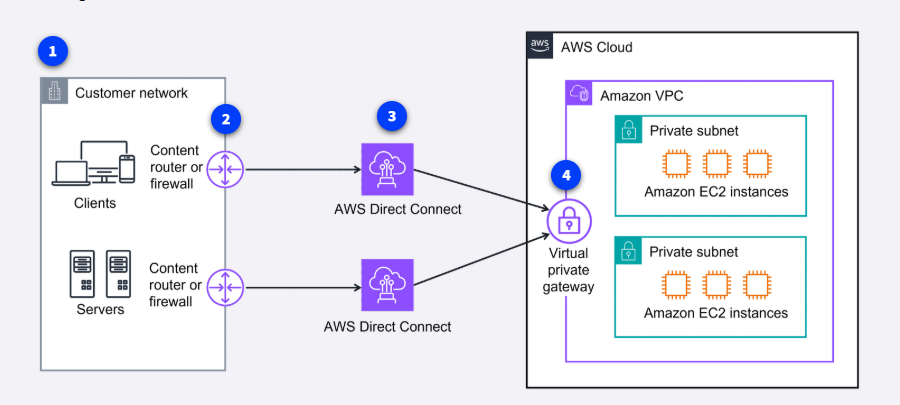
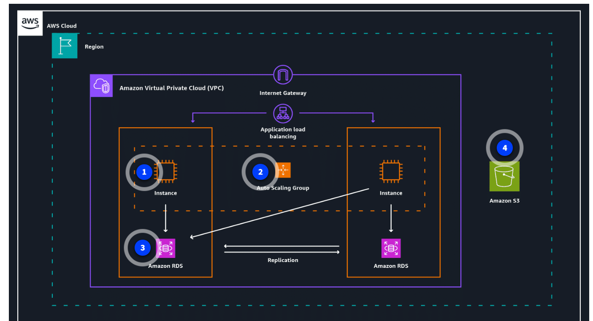

VPC : Its a Virtual Private cloud on AWS

With Amazon VPC, you can provision an isolated section of the AWS Cloud. In this isolated section, you can launch resources in a virtual network that you define. It provides three main benefits. It helps increase security because you can secure and monitor connections, screen traffic, and restrict instance access. Amazon VPC gives you full control over your resource placement, connectivity, and security. The convenience of using Amazon VPC means you will spend less time setting up, managing, and validating your virtual network when compared to on-premises network management.

Subnets

Within an Amazon VPC, you can organize your resources into subsections or subnets. A subnet is a section of an Amazon VPC that can contain resources, such as Amazon EC2 instances. You will learn more about subnets in the next lesson.

Connecting your resources with an internet gateway

To allow public traffic from the internet to access your VPC, you attach an internet gateway to the VPC. An internet gateway is a connection between a VPC and the internet. You can think of an internet gateway as being similar to a doorway that customers use to enter the coffee shop. Without an internet gateway, no one can access the resources within your VPC.

Edge networking services

Secure and speedy networking for user-facing application data

Edge networking is the process of bringing information storage and computing abilities closer to the devices that produce that information and the users who consume it. Edge computing is important because organizations often need lower latency access to their data and content. By performing tasks or caching data locally or closer to users, organizations can deliver faster, more responsive experiences while maintaining better control over their infrastructure. There are also many different services that are hosted on the edge, like the DNS service, Amazon Route 53.

Amazon Route 53

Route 53 is a DNS that provides a reliable and cost-effective way to route end users to internet applications.

Route 53 directs end users to your resources with globally dispersed DNS servers and automatic scaling. It gives developers and businesses a reliable way to route end users to internet applications hosted in AWS. It connects user requests to infrastructure running in AWS, such as Amazon EC2 instances and load balancers. It also routes users to infrastructure outside of AWS.

Another feature of Route 53 is the ability to manage the DNS records for domain names. You can register new domain names directly in Route 53. You can also transfer DNS records for existing domain names managed by other domain registrars. This makes it possible for you to manage all of your domain names within a single location.

Route 53 also works with the next AWS edge networking service, Amazon CloudFront.

Amazon CloudFront

CloudFront is a content delivery network (CDN) service that delivers your content with faster loading times, cost savings, and reliability.

Three trucks representing CloudFront, hauling content to different global locations on a globe.
CloudFront is like a global network of delivery trucks that quickly brings web content to users around the world. Instead of all requests traveling back to one central warehouse (your original server), CloudFront stores copies of your content at locations closer to your users. This means websites, videos, images, and applications load much faster, no matter where your customers are located.

AWS Global Accelerator

Global Accelerator is a service that uses the AWS global network to improve application availability, performance, and security. It uses intelligent traffic routing and fast failover if something goes wrong in one of your application locations.

Global Accelerator is a networking service that helps your applications run faster and more reliably across the globe. Think of it like creating express lanes on the internet highway specifically for your application's traffic. Instead of your users' requests taking the regular, sometimes congested internet routes, Global Accelerator directs traffic through the AWS private global network—getting your users to your application faster and more reliably.

App based deployment setup

Direct Connect failover when you need much higher bandwidth with dedicated lines

You've seen a basic VPN and AWS Direct Connect setup in previous lessons. Here is the video example of a company with clients and servers that demand high bandwidth connections for large data transfers and critical application performance. They chose to access their AWS resources securely with multiple Direct Connect connections for failover.

To learn more about using Direct Connect for failover and to aggregate bandwidth, choose each of the following four numbered markers.

