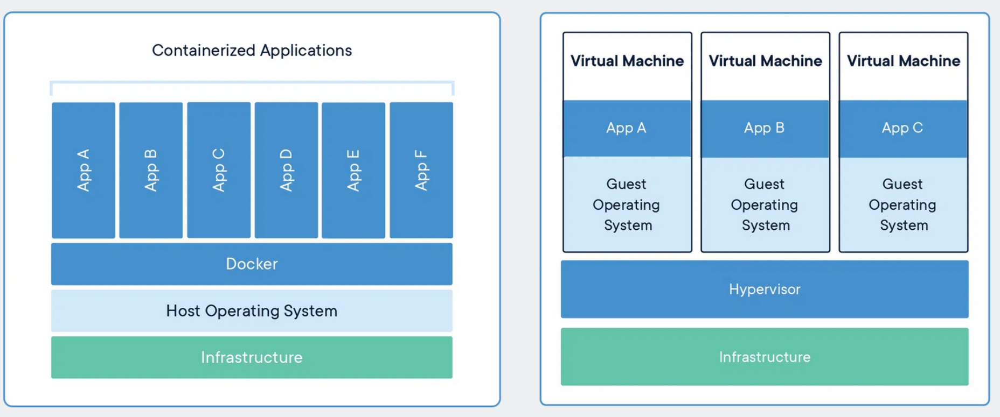
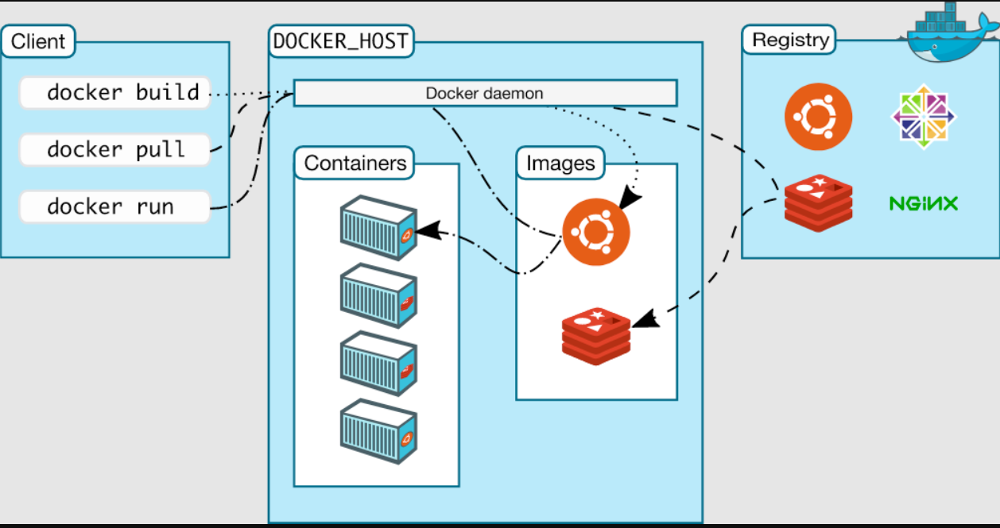

### Containers

What are containers ?

Container is a package that has combination of application libraries + system libraries

We can create containers on top of VM or physical machine as well

Modern approach is to put containers on top of EC2

We can talk from one container to another container

Its lightweight in nature, they do not have a complete OS and they use the resources of base OS

To create a container : Write a docker file or docker compose file it will create an image and to execute this image we can then run container, containers gets uploaded to docker hub and it runs through docker engine

docker build > docker run



Files and Folders in containers base images

    /bin: contains binary executable files, such as the ls, cp, and ps commands.

    /sbin: contains system binary executable files, such as the init and shutdown commands.

    /etc: contains configuration files for various system services.

    /lib: contains library files that are used by the binary executables.

    /usr: contains user-related files and utilities, such as applications, libraries, and documentation.

    /var: contains variable data, such as log files, spool files, and temporary files.

    /root: is the home directory of the root user.


Files and Folders that containers use from host operating system

    The host's file system: Docker containers can access the host file system using bind mounts, which allow the container to read and write files in the host file system.

    Networking stack: The host's networking stack is used to provide network connectivity to the container. Docker containers can be connected to the host's network directly or through a virtual network.

    System calls: The host's kernel handles system calls from the container, which is how the container accesses the host's resources, such as CPU, memory, and I/O.

    Namespaces: Docker containers use Linux namespaces to create isolated environments for the container's processes. Namespaces provide isolation for resources such as the file system, process ID, and network.

    Control groups (cgroups): Docker containers use cgroups to limit and control the amount of resources, such as CPU, memory, and I/O, that a container can access.
    
Docker Architecture 



 
# 🐳 Docker CLI Cheatsheet

---

## 🔧 Basics
```bash
docker --version         # Show Docker version
docker info              # Show system-wide Docker info
docker help              # Get help
```

---

## 📦 Images
```bash
docker images                      # List images
docker pull ubuntu:20.04           # Download image from registry
docker build -t myapp:1.0 .        # Build image from Dockerfile in current dir
docker rmi myapp:1.0               # Remove image
docker tag myapp:1.0 myrepo/myapp:1.0   # Tag image for registry
docker push myrepo/myapp:1.0       # Push image to registry
```

---

## 📦 Containers
```bash
docker ps                          # List running containers
docker ps -a                       # List all containers (including stopped)
docker run -it ubuntu:20.04 bash   # Run new container (interactive shell)
docker run -d -p 8080:80 nginx     # Run in detached mode, map port 8080→80
docker start <container_id>        # Start stopped container
docker stop <container_id>         # Stop running container
docker restart <container_id>      # Restart container
docker rm <container_id>           # Remove stopped container
docker logs <container_id>         # View logs
docker exec -it <container_id> bash   # Run command inside container
```

---

## 📂 Volumes (Persistent Data)
```bash
docker volume ls                   # List volumes
docker run -v mydata:/data nginx   # Mount named volume
docker volume rm mydata            # Remove volume
```

---

## 🌐 Networks
```bash
docker network ls                  # List networks
docker network create mynet        # Create new network
docker run -d --network=mynet nginx   # Run container in specific network
```

---

## 📑 Inspect & Info
```bash
docker inspect <container_id>      # Detailed JSON info (config, IP, etc.)
docker stats                       # Live resource usage of containers
docker top <container_id>          # Show running processes in container
```

---

## 🧹 Cleanup
```bash
docker system df                   # Show space usage
docker system prune                 # Remove unused data
docker container prune              # Remove stopped containers
docker image prune                  # Remove unused images
docker volume prune                 # Remove unused volumes
```

---

## 🐙 Docker Compose (multi-container apps)
```bash
docker-compose up -d               # Start services defined in docker-compose.yml
docker-compose down                # Stop and remove containers
docker-compose ps                  # List services
docker-compose logs -f             # Tail logs
```

---

## 🔑 Tags & Versions
```bash
docker pull redis                  # Pull latest (implicit :latest)
docker pull redis:6.2              # Pull specific version
docker run redis:alpine            # Run slim Alpine-based variant
```

---

## ✅ Quick Visual Flow
- `docker build` → Create image  
- `docker pull` → Fetch image  
- `docker run` → Start container  
- `docker ps` → List containers  
- `docker exec` → Jump inside container  
- `docker stop` → Stop container  
- `docker rm` → Delete container  
- `docker rmi` → Delete image  
