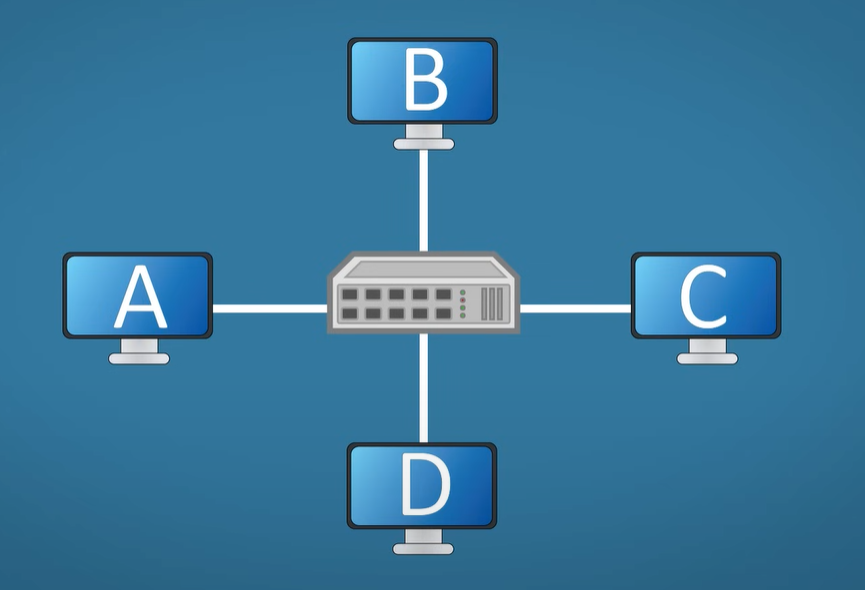
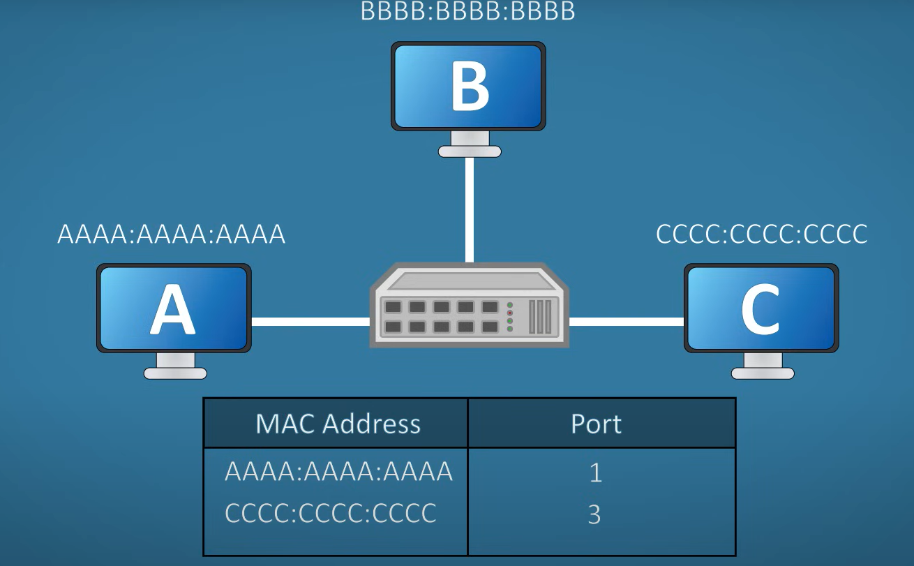

Network : Two or more devices connected with each other with switch, Access Poibt, Router

LAN : Local Area Network 
WAN : Wide Area Network

Netwoork Devices :

Hub : Two or more devices can connect with a hub

It uses half duplex : cant send 

It is a layer 1 device

1 Collission Domaon

Security Risk : its data is sent to all the device connecyed

Bridge : Layer 2 device , it can understand and learn mac address
Segnmets LAN
2 Collision domaons , it can send and receive data

Switch : Layer 2 device

its a full duplex , it can send and recieve data at the same time

------------------------------------------------------------------------------------------
Important topics for DevOps

TCP/IP
DNS
http/https
Load balancers
Firewalls
Network Protocols
Subnetting

