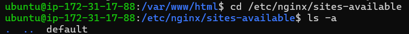
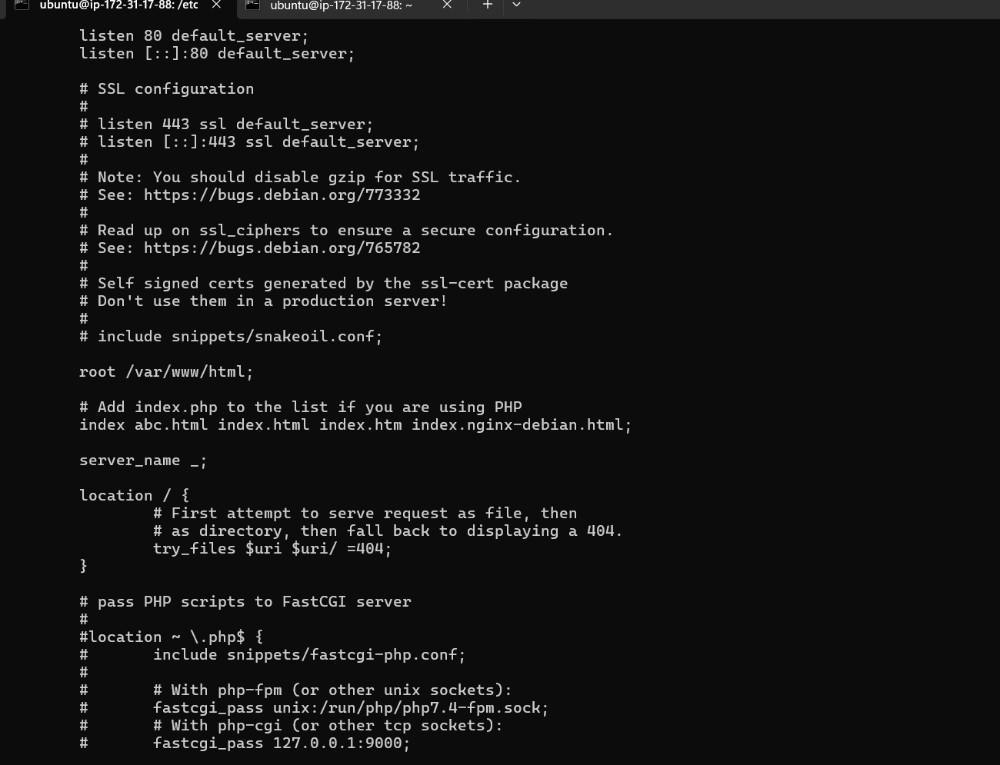
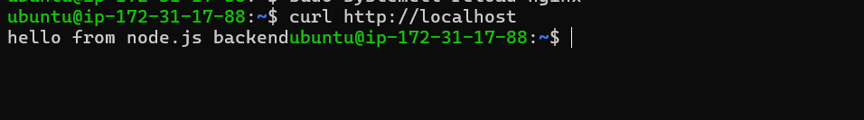
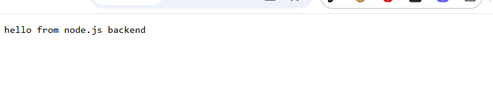

Nginx : Enginex : Nginx was initially launched as high performance web server to server static content

It is used for 

Reverse Proxy 
Load Balancer
Http Caching


### Using Nginx as web server

A web server is a softyare that serve static files (liek .html .css .js .png) over http.

When we visit our website the server send response with these files 

To use nginx to send this file to we can do following test 


we can do ` echo "<h1> Hello from Hasan</h1>" | sudo tee /var/www/htmlabc.html`

To make sure the changes do appear, we need to go to `cd cd /etc/nginx/sites-available` and then update the default file with abc.html for oirder precedence





Then we need to do ` sudo systemctl reload nginx` to make it effective


For validating nginx ` sudo nginx -t`

#### Rerverse Proxy 

What is a reverse proxy

A reverse proxy is server that receives client requets and forwards them to backend servers 

To do so we we would need to create a small nodejs server

``` 
const http = require ('http');
http.creteServer((req, res)=>{
    res.end('Hello from the tiny server block);
}).listen(3000); 

```
Then run the server with node server.js

it should be up and running and we can see it with curl http://127.0.0.1:3000

No we can implement reverse proxy usinhg proxy pass 

To do so we need to update the default file at location /etc/nginx/sites-avaiable/default

```
server {
    listen 80;
    server_name localhost;

    location /{
        proxy_pass http:localhost:3000;
        proxy_set_header Host $host 
        proxy_set_header X-Real-IP $remote_addr;
    }
}

```
we need to check ss -tlnp | grep 3000 if the server is up and runnning and listening to port 3000

also we need to check nginx cinfiguration test with 

```
sudo nginx -t
```

if everything is well we can start with 
```
sudo systemctl reload nginx

```

This would show the website 

local : 
worldwide : 

We need to allow 0.0.0.0/